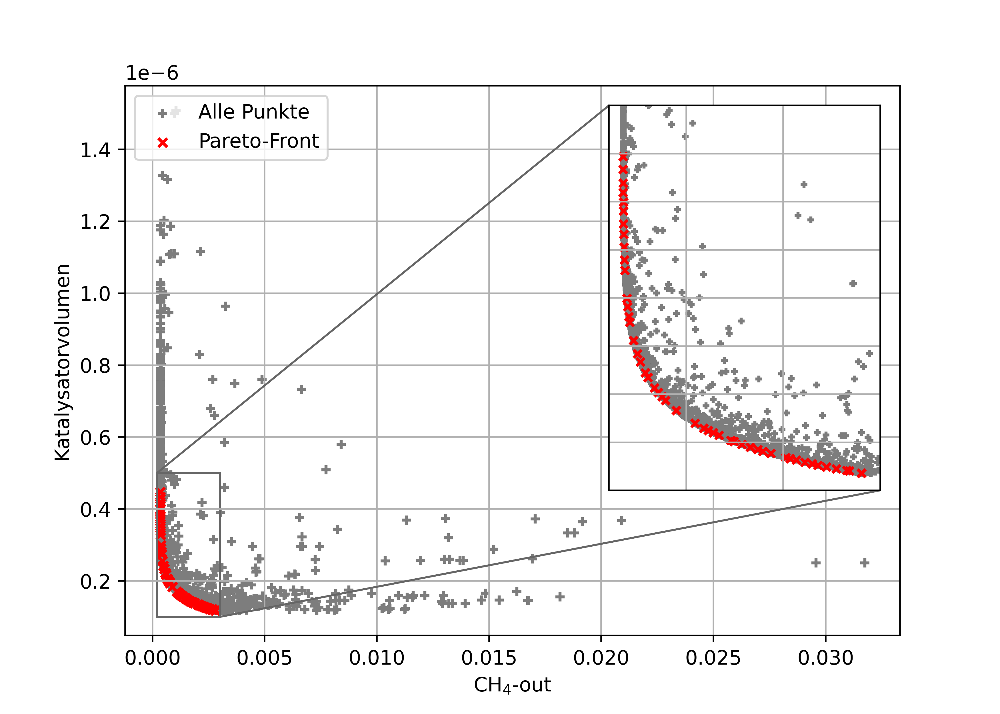

# Modellierung und Optimierung chemischer Reaktoren

Dieses Repository zeigt die **Modellierung, Simulation und Optimierung chemischer Reaktoren** mit Python und Cantera.  
Der Fokus liegt auf der **Verknüpfung physikalischer Modelle mit numerischen Methoden und Optimierungsalgorithmen**.

---

## Key Features
- Modellierung eines **Plug-Flow-Reaktors (PFR)** über eine CSTR-Kaskade  
- Simulation **gekoppelter Reaktionskinetik** (z. B. katalytische Systeme)  
- Ein- und **multikriterielle Optimierung** (z. B. Umsatz vs. Reaktorvolumen)  
- Integration von **Cantera** für detaillierte Stoffmodelle  
- Analyse von **Temperatur-, Konzentrations- und Umsatzprofilen**

---

## Technologien
- **Python** (NumPy)
- **Cantera**
- **pymoo** (NSGA-II für Multiobjective Optimization)
- **Tensorflow**
- **scikit-learn**

---

## Projektstruktur

### Seminare
Umsetzung ausgewählter Modellierungsansätze mit verschiedenen Tools:

- Seminar 1: Python-Grundlagen  
- Seminar 2: Chemkin  
- Semiar 3: ANSYS Fluent  
- Seminar 4–5: ModeFrontier  
- Seminar 6–7: KI-basierte Modellierung (Python)

---

### Praktikum
Begleitende Implementierungen zur Vertiefung:

- Python-basierte Optimierung  
- Einführung in Cantera  
- Kopplung von Simulation und Optimierung  

---

### Belegarbeit
Kern des Projekts:

- Aufbau eines **PFR-Modells als CSTR-Kaskade**
- Simulation eines **reaktiven Systems mit detaillierter Kinetik**
- Durchführung von:
  - **Single-Objective Optimization**
  - **Multi-Objective Optimization (Pareto-Fronten)**

---

## Ergebnisse
Typische Auswertungen:

- Pareto-Fronten (z. B. Umsatz vs. Reaktorvolumen)  
- Temperaturprofile entlang des Reaktors  
- Einfluss von Betriebsparametern auf Reaktionsverlauf  

  
   
  <em>Pareto-Optimierung: CH₄ vs. Katalysatorvolumen</em>

*(weitere Plots und Ergebnisse können im Repository eingesehen werden)*

---

## Motivation
Ziel ist die Entwicklung eines **daten- und modellgetriebenen Ansatzes** zur Beschreibung chemischer Prozesse.  
Der Fokus liegt auf:
- physikalisch fundierter Modellierung  
- effizienter numerischer Umsetzung  
- systematischer Optimierung komplexer Systeme  

---

## Hinweise
- Die Inhalte wurden im Rahmen eines Universitätsmoduls erstellt  
- Fokus liegt auf **Methodenverständnis und Modellierung**, nicht auf produktionsreifer Software  
- Teile (z. B. kommerzielle Software) sind nicht im Repository enthalten  